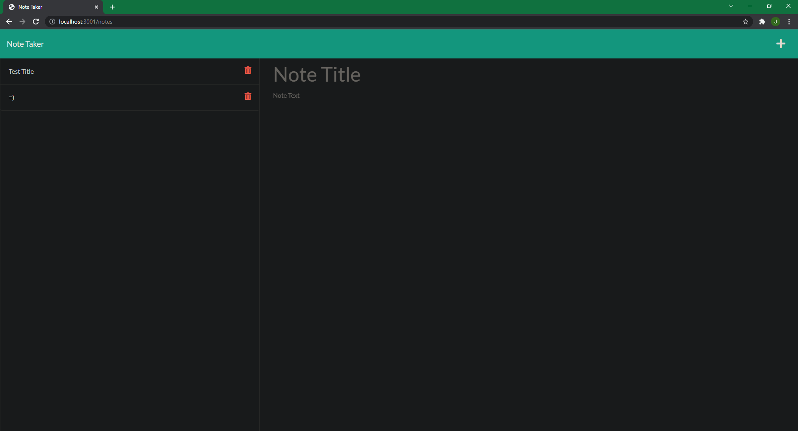

## Description

noteTaker is a web application that allows the user to create a note and save it to a json file. The user can also delete the notes by clicking the trash can.

https://floating-falls-31567.herokuapp.com/
